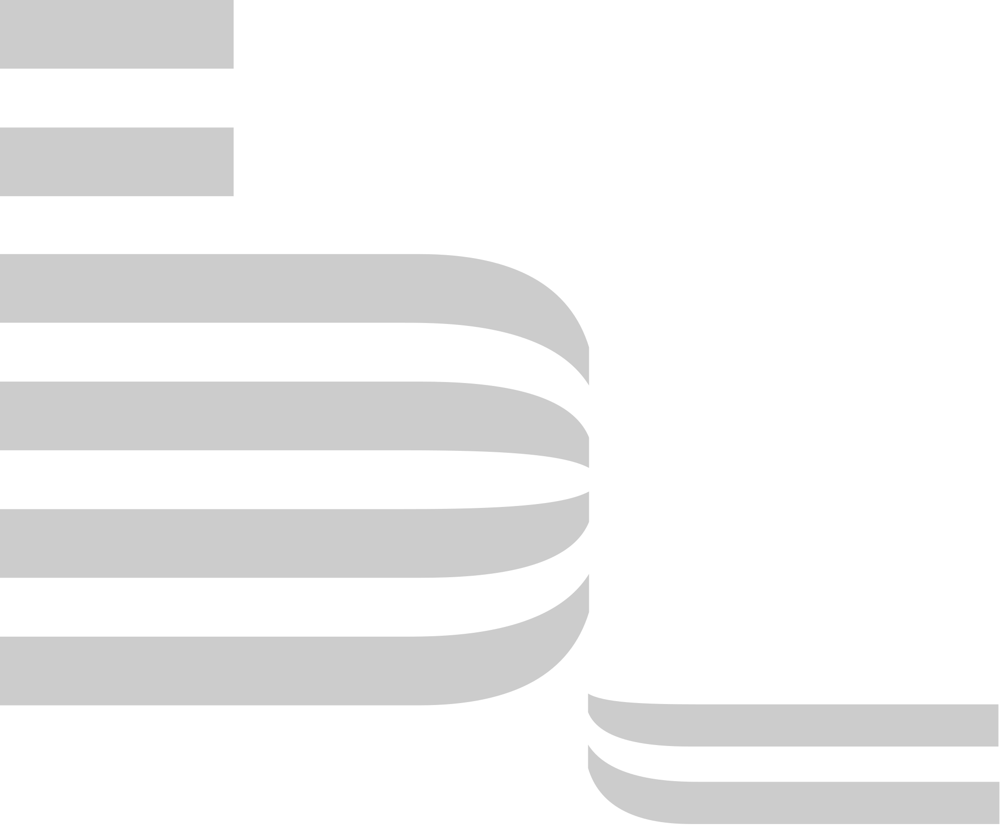

## Привет👋

### Меня зовут Вячеслав, я начинающий веб-разработчик, студент Яндекс.Практикума.

Здесь Вы можете найти репозитории с моими учебными проектами, а также проекты, которые я делал для себя.

⚙️ **Мой стек:**
<code>

</code>

☎️ **Контакты:**

🏆 **Статистика:**

